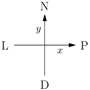

Kevinovi rodiče si pořád stěžují na jeho nepořádek, který se postupně rozrůstá i za hranice jeho pokoje. Kevin se proto jednoho dne rozhodl, že se s tím pokusí něco udělat. Pořídil si tedy krabici a všechny svoje věci, které jeho okolí nazývalo nepořádkem, přemístil do krabice. Pak ale zjistil, že krabice je moc těžká. Nejenže ji neunese, dokonce ji ani nezvládne tlačit po podlaze. Protože znovu přeskládávat věci by dalo moc práce, rozhodl se využít pravidla „Když to nejde silou, půjde to větší silou.“ A pořídil si **automatizovaný buldozer, kterým plánuje přepravovat svoji krabici.**

Pro potřeby naší úlohy si můžeme představovat Kevinův pokoj jako **čtvercovou mřížku**. Na začátku je na nějakém políčku buldozer a na jiném krabice. Buldozer pak od Kevina dostává instrukce, které mu říkají, že se má přesunout na jedno ze sousedních políček mřížky. Pokud je na cílovém políčku krabice, tak buldozer bude tlačit do krabice a kromě přesunu buldozeru o jedno políčko se ve stejném směru posune i krabice.

Kevin rád s buldozerem jezdí opravdu daleko, takže po chvíli na něj přestal vidět. Kevin si ovšem poctivě **zapisuje, jaké instrukce postupně buldozer vykonal**. Zajímalo by ho, na jaké pozici po provedení těchto instrukcí skončil buldozer a na jaké krabice. Váš úkol bude toto spočítat.

## ÚKOL 

Formát vstupu: Na vstupu jsou souřadnice **zadány jako dvě celá čísla oddělená mezerou**:

- první z nich udává vzdálenost ve směru vlevo-vpravo (vpravo je kladný směr),
- druhé číslo udává vzdálenost ve směru dolů-nahoru (nahoru je kladný směr).

1. Na prvním řádku jsou čísla **xB yB** – souřadnice buldozeru. 
2. Na druhém řádku **xK yK** – souřadnice krabice.
3. Na třetím řádku posloupnost znaků **NPLD**, což jsou pohyby buldozeru (Nahoru, doPrava, doLeva a Dolů). 

Formát výstupu: 
- Na prvním řádku má být **xB' yB'** – finální souřadnice buldozeru po vykonání všech instrukci. 
- Na druhém řádku pak **xK' yK'** – finální souřadnice krabice po vykonání instrukcí.

